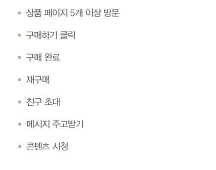
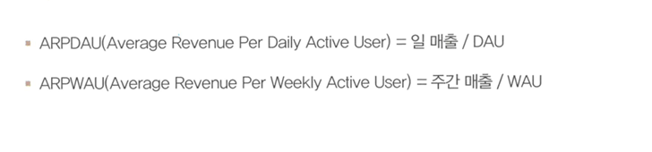
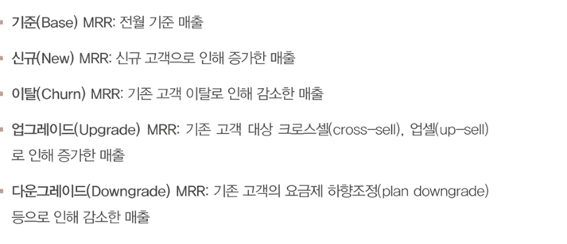
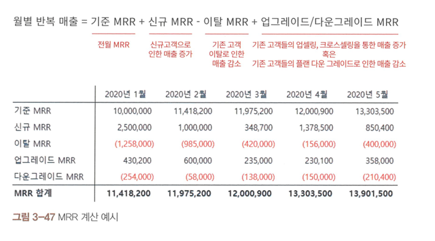
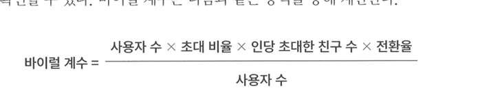
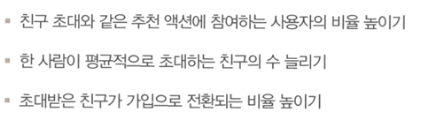

## 리텐션
---

**리텐션(유지율)**

서비스의 성공을 예측할 수 있는 가장 기본적이면서 중요한 지표

---

>리텐션이 좋지 않더라도 성장곡선을 그릴 수 있으나 한 순간에 지표가 나빠지기도 한다.

**리텐션은 대표적으로 잘 하고 있을 때 일수록 더 세심하게 측정하고 관리해야하는 지표에 속한다**

## 리텐션 기준

리텐션은 일반적으로 **접속**을 기준으로 측정한다.

>그러나 기준이 되는 행동을 꼭 **접속으로 한정할 필요는 없다.**

>중요한 것은 사용자가 서비스에 진입하는 행동이 반복되는 지 여부를 살펴보는 것이다.

리텐션은 개선하기 어려운 지표이지만 **복리 효과**를 가져오는 대표적 지표이기에 중요하다

## 리텐션 측정하는 세 가지 방법

**클래식 리텐션 (Day N 리텐션)**

가장 일반적인 유지율 계산 방법

>**이벤트가 처음 발생한 날짜**를 기준으로 하루하루 **시간이 지남에 따라 몇 명이 해당 이벤트를 반복했는 지** 집계하는 방식

> 특정일에 접속했는 지 여부는 고려 x

---
단점
1. 특정일의 노이즈에 민감
2. 일 단위 로그인 데이터를 모두 확복하고 있어야 계산 가능
---

**매일 접속해서 사용할 것으로 기대되는 서비스에 적절한 지표**

>ex) 전화, sns, 메신저

##  범위 리텐션

특정 기간에 이벤트를 발생시킨 유저의 비율 계산

**클래식 리텐션**

공통점:
> 설명하기 쉽고 직관적

차이점 :
>노이즈가 크지 않다.

**단점**

1. 기간이 길어질 경우  과대 추정이 될 수 있다.

2. 의미 있는 경과를 보기 위해 어느 정도 기간이 축적되어야 하기에 오랜 시간 필요

** 굳이 매일 접속하지 않더라도 일정 간경으로 꾸준히 사용하는 것 **

ex) 가계부, 음식배달 서비스

## 롤링 리텐션

떠난 유저를 집계해서 리텐션 계산

**장점**

최초 로그인 시점과 마지막 로그인 시점에 대한 데이터만 있으면 계산 가능

**단점**

한번이라도 로그인 하는 경우 모든 기간이 활동 기간으로 인정하는 특성 때문에 '과대추정' 경향이 강하다.

 **사용 빈도가 높지 않은 서비스에서 유용하게 활용**

 ex) 의류 쇼핑 서비스 , 여행 서비스 

 ## 인게이지먼트

 약식 리텐션
 **DAU와 MAU** 로 나눠서 인게이지먼트 지표 구하기

매일 동일한 사용자가 반본적으로 들어오는지 혹은 날마다 새로운 사용자가 들어오는지를 빠르게 가늠할 수 있게 해준다

**주기적으로 사용하는 서비스에 적합** 

ex) 전화 메신저

>그러나 인게이지먼크 지표 비교는 서비스 마다 dau와 mau 측정 기준이 달라 어려움

## 리텐션 분석

코호트에 따른 차이 분석

>코호트의 기본은 **날짜**

시간에 흐름에 따라 좋아지고 있는 나빠지고 있는지를 판단할 수 있기 때문

>**유입 채널별**도 기준이 됨.

충성 고객 전환 비율 확인 가능

## 리텐션 차트

**구성요소**

1. 코호트 

2. 볼륨

3. 기간

4. 유지율

## 리텐션 차트를 통해 유용한 인사이트 탐수

1. 하나의 코호트 안에 기간에 따른 유지율을 봤을 때 그 추이는 어떠한가

- 안전화되는 지점은?

2. 서로 다른 코호트의 동일한 기간의 유지율 비교하면 어떠한가

3. 기간에 따라 나눈 코호트 규모의 추이는?

## 리텐션  개선하기

1. 초기에 리텐션이 떨어지는 속도 늦추기

> 활성화 프로세스의 영향
서비스에 처음들어와서 가입하는 **동선** , 서비스 핵심 기능을 사용하는 프로세스를 **단계**별로 쪼개서 살펴보는 것이 좋다

2. 리텐션이 안전화된 이후 기울기 평평하게 유지하기

>정기적인 커뮤니케이션 플랜이나 crm 마케팅 활동, 주기적 프로모션 진행이나 복귀 명분을 위한 리마케팅 진행

## 수익화

비즈니스 모델 이해 및 동작 유무 ,비용 대비 수익 확인 필수적

## 수익화 관련 주요 지표

ARPU

1. **사용자 정의 중요**
2. **매출 기준 기간 중요**

ARPPU
결제자만을 대상으로 평균 구하기

>기간은 보통 월간 결제자를 바탕으로 계산

## 고객 생애 가치(LTV)

한 명의 사용자가 진입하는 순간부터 이탈하는 순간까지의 전체 활동 기간 누적 발생 수익

**현실에서 정확한 LTV 계산은 어려움**

## 고객 생애 매출

한 명에 대한 기대 매출

**유지 비용이나 획득비용 고려 X**

## 수익화 분석하기

1.LTR 활용하기

LTR은 가입 시점 등의 기준으로 코호트를 나누어 추이 변화를 살핌

>코호트별로 증가그래프를 그려 고객획득 비용과 고려하면 수익 모델이 잘 되는 지 확인할 수 있다

**기준은 CAC의 5~10배로 LTR이 높아져야함**

## 수익화 쪼개서 보기

1. 아이템 별 매출의 합계

2. 사용자 세그먼트별 매출의 합계

3. 결제자 수 X ARPPU

## 월별 반복 매출

## 수익화 정리

1. 대부분의 수익화 지표는 평균값이지만, 실제로는 소수의 사용자가 대부분의 매출을 발생시키는 경우가 많다

2. 과거와 달리 지금은 사용자를 모으는 것과 별개로, 서비스 초기부터 어떤 방식으로 수익화할지에 대한 명확한 로드맵이 있어야만 성공하는 서비스가 될 수 있음

## 추천

기존 사용자의 추천이나 입소문을 통해 새로운 사용자 데려오는 것 의미

## 친구 초대 플로 설계

1. 초대맥락

> 단순히 보상기능만 제공하는 것으로 유도 어려움

2. 메시지 / 보상

>이타적 문구가 효과적일 수 있음

>직접적 현금성 보상 제공 사례가 늘고 있음

3. 온보딩 프로세스

초대받은 친구가 메시지 받고 설치, 가입

## 바이럴 계수

추천 엔진이 얼마나 효과적으로 동작하는 지

계수를 높이는 충족 조건

**바이럴 계수가 1**이 넘어가는 것이 좋음

## 고려 사항

'속도'는 계수에 반영되지 않으므로 초대 주기 빠르게 만드는 것도 신경써야함

목표 시정의 포화도 고려

추천 유입 사용자의 충성 사용자 전환 비율을 확인해야함

## 지표

**스톡 지표**

특정 시점에 스냅숏에 해당하는 누적된 값

-> 누적 가입자 수 누적 거래액

단점

단순 누적량을 보여주는 허무지표가 될 수 있음

**플로 지표**
특정 기간 동안의 변화량을 나타내는 지표

-> 1월 1일의 가입자 수 2월 1일 하루 매출

세부적 정보를 포함해 더 많은 정보 가지고 있음

목표 지표를 정확히 **구분** 하는 것이 중요

## 지표를 명확히 정의

**조작적 정의의 필요성**

MAU는 명확, 실제로 어떻게 측정할 것인지에 대한 조작적 정의가 명확하지 않으면 숫자를 구하기가 어려움
예시

**원칙 세우기**

결제 전환율 같은 지표도 측정 기준이 다양함

>MAU나 결제 전환율이라는 지표를 어떤 방식으로 측정해서 관리할지에 대한 공감대를 형성하고 모든 구성원이 동의할 수 있는 명확한 측정 기준을 정의할 필요가 있음

##  허무 지표에 빠지지 않기

허무 지표의 개념

행동을 이끌어내지 못하는 의미 없는 지표를 허무 지표 또는 허상 지표라고도 함

EX)  누적 다운로드, 누적 앱 설치, 누적 방문자, 페이지 뷰 등

**허무 지표의 함정**

많은 조직이 실제 서비스 성공과는 거의 상관없는 허무 지표로 보고서를 작성

##  전체 관점에서의 최적화

지표 개선을 위GO 전체 관점에서의 최적화에 초점을 맞춰야 함

**부분 최적화의 위험**

특정 페이지의 클릭률(CTR)에만 집중하다가 전체 전환율이 떨어지는 등의 문제가 발생할 수 있음

## 심슨 패러독스

쪼개진 데이터에서 성립하는 관계가, 데이터를 합쳤을 때는 반대로 나타나는 현상

1. 버클리 입시 결과

2. 크로스셀 비율을 높이는 실험을 진행

## 대푯값을 사용할 때 주의해야 할

데이터 분석에서 가장 일반적으로 활용되는 대푯값은 평균이, 평균이 모든 경우에 최선은 아님

**평균의 함정**

데이터가 정규분포가 아니거나 이상치가 있으면 평균은 그 데이터를 대표하지 못하는 경우가 많다.

올바른 접근하려면?

데이터 분포를 알 수 없거나 이상치가 있다면 평균보다 훨씬 안정적인 **중앙값** 을 **대푯값**으로 사용하는 것을 고려해야 함

분석을 시작할 때 산점도나 상자 수염 그림 등으로 데이터가 어떤 분포를 보이는지 시각적으로 확인하는 탐색적 데이터 분석(EDA) 과정을 충분히 거쳐야 함

## 생존자 편향피하기

성공적으로 살아남은 데이터만 선택적으로 수집해서 분석했기 때문에 잘못된 결론을 내는 경우

## 4.2 OMTM

## 지금 가장 중요한 지표는?

지금 가장 중요한 단 하나의 지표:  OMTM(One Metric That Matters) ,북극성 지표

>모든 지표를 측정하고 관리하기는 어려움

단순 지표를 나열하는 것 만으로는 지표 간 우선순위를 정의할 수 없음
OMTM의 가치는 구성원들이 바라보는 방향성을 일치시키고 자원을 집중하는 데서 나옴
하나의 서비스에서는 기획, 개발, 디자인, 운영 등 모든 구성원이 직군과 상관없이 같은 시기에 같은 OMTM을 바라봐야 함

## OMTM을 정의는?

어떤 비즈니스 모델을 가진 서비스를 만들고 있는가?

서비스 라이프 사이클을 고려할 때 우리는 어떤 단계에 있는가?

지금 가장 신경 쓰이는 단 하나의 문제를 찾아보자, 어떤 문제인가?

우리가 원하는 행동을 하는 사용자와 그렇지 않은 사용자는 무엇이 가장 다른가?

위의 사용자를 구분할 수 있는 이벤트나 속성은 무엇이고, 그 추세가 달라지는 지점은 어디인가?

>매출을 OMTM으로 정하는 것은 부적절한 경우가 많음 매출은 후행지표이기 때문에 

## OMTM & KPI & OKR
OMTM vs KPI

OMTM: '성장'을 위한 지표, 과정과 '협력'을 중시, '평가'를 위한 지표, 달성 여부가 중요 '경쟁'을 유도할 수 있음

**범위**

OMTM 모두가 공유하는 하나의 목표, 팀이나 부서별로 서로 다르게 설정 심한 경우 한 팀의 KPI 달성이 

**유연성**

OMTM: 서비스 성장 속도에 따라 시기마다 변경될 수 있음, 한번 정해지면 평가 때까지 거의 바뀌지 않음

**결과**

OMTM이 움직인다는 것은 서비스가 올바른 방향으로 성장하고 있음을 의미
모든 부서가 KPI를 달성했는데 서비스 실적은 좋지 않은 경우가 많음
