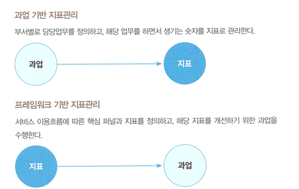
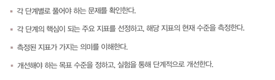
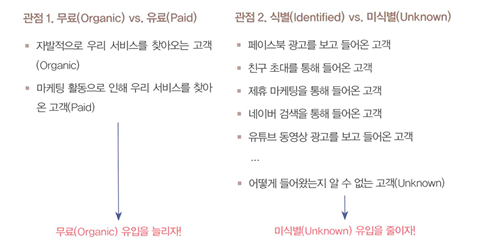

1.1  그로스 해킹 그거,우리도 해봅시다

그로스 해킹 : 성장할 수 있는방법을 해킹 하는 것

고객의 취향이 세분화되며 구매가 불확실해짐

린스타트업 : 아이디어를 빠르게 제품으로 만들고 고객이 제품에 대해 어떻게 반응하는 지 측정한 후 그 결과를 통해 배움을 얻고 지속적으로 제품을 개선해가는 제품 개발 방법론

--> 빠른 출시와 개선으로 완성도를 높인다는 측면에서 그로스 해킹이 가진 철학과 일맥상통하는 측면이 있다

1.2 그로스 해킹의 지름길이 있을까

핫메일 : 최초의 무료 웹 메일 서비스

에어비앤비 : 공유 숙박

드롭박스 : 클라우드 저장소 제공 서비스

--> 성공한 그로스 해킹 사례

그로스 해킹은 각 서비스의 사용맥학이나 시장 상황을 반영해서 진행할 때만 의미가 있다

<그로스 해킹 강의>

1.데이터 분석 머신러닝에 대한 스킬셋을 가르치는 강의

2. 주요 퍼포먼스 마케팅 채널에 대한 스킬셋을 가르치는 강의

=> 그래서 내 서비스에서는 뭘?

그로스 해킹 목표 : 데이터에서 찾아낸 인사이트를 바탕으로 제품이나 서비스를 지속적으로 개선해 나가는 방법

=> 전체 프로세스에 대한 폭넓은 이해 필요

1.3 그로스 해킹 이해하기

<크로스펑셔널 팀>

여러 직군 간 협업 필수 (목적 기반 구성 조직)

<린스타트업>

제품개발,지표측정,학습 개선 이라는 사이클 빠르게 반복해 학습비용 줄이고 성공 가능성 높이는 개발 프로세스

<최소 기능 제품>

가설을 검증할 수 있는 최소한의 기능이 포함된 제품

<AARRR 해적지표>

 고객 유치 활성화 리텐션 수익화 추천 다섯가지 범주에 따라 주요 지표 모니터링 및 관리

 2.1 뭐가 문제인지 모르는 게 문제

사람 유치가 어렵다고 새로운 기능을 추가해 완성도를 높이는 것은 의미가 없다

2.2 정말 많은 제품 관리자가 하는 실수

1. 제품을 먼저 만들고 고객을 찾는다

논리의 완성도를 높인다고 성공 가능성이 높아지는 것이 아니다

2. 기능을 추가하고 추가하고 추가한다

서비스 개선이라는 용어를 기능 추가와 동일한 의미로 사용한다

--> 문제가 되는 이유 : 추가되는 기능만큼 서비스의 복잡도는 높아지고 뒤따라오는 레거시가 늘어난다

제품은 가설의 조합으로 이뤄져야하며 그러한 가설을 테스트하기 위한 최소한의 기능으로 이뤄져야한다

2.3 제품-시장 적합성

우리가 만든 제품이나 서비스가 그로스 해킹 할 만한 가치가 있는가

1, 우리가 생각하는 그 문제가 진찌 있긴 한가

많은 제품들이 존재하지 않는 문제를 가정하며 만들어진다

2.우리가 만든 제품이 그 문제를 해결한게 맞나?

제안 솔루션이 문제를 해결하는 지 확인

3. 이 제품을 만들면서 세운 가설은?

이 제품을 통해 검증하려 했던 가설이 무엇이었고 검증결과가 어땠는 지 답을 할 수 있어야함

2.4 제품-시장 적합성 확인

1. 리텐션-시간과 반비례 관계

사용자들이 특정 서비스에 얼마나 꾸준히 남아서 활동하는 지 보여주는 지표

<시간과의 기울기가 얼마나 완만한지 안정화되는 지점이 어딘지 확인>

리텐션은 서비스가 속한 카테고리의 영향을 크게 받기 때문에 기준을 세우기 어려움

2. 전환율- UI/UX의 영향을 많이 받음

한 단계에서 다음 단계로 넘어가는 사용자의 비율 의미

역삼각형이 일반적이고 리텐션과 비숫하게 카테고리의 영향을 많이 받는다

유입 경로 또한 영향을 준다

3. 순수 추천 지수(NPS)

이 서비스를 주변 지인이나 친구에게 얼마나 추천하고 싶으신가요?

-리커트 척도로 받음

적극적 추천 그룹 (9~10)
-충성 사용자 그룹

소극적 추천 그룹 (7~8)
- 타 제품 이탈 가능

비추천 그룹 (0~6)
-이탈 가능 높음

범위

-1< NPS <1

중간층을 늘리는 것보다 팬층 (적극적 추천 그룹)을 늘리는 게 중요하다

그렇다면 고객 유치가 안되는 상황에서 해야할 것은?

제품 -시장 적합성을 찾는 것 리텐션과 전환율은 이를 확인하기 위한 수단

-> 즉 사용자에 대해 더 많이 연구하고 사용자를 이해하려고 노력하는 것이 필요함

= 1:1 사용자 인터뷰 ,행동 관찰 > (포커스 그룹 인터뷰)

이는 가설을 확인하는 과정이 아닌 사용자의 의견을 이해하는 과정임을 인지

<인터뷰(PMF탐색과정) 외의 정량적 방법>

사용자 행동 로그를 잘 기록하고 있다면 사용자의 행동 예측 가능

